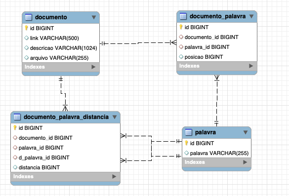

## Sumário
- [Architecture decision record (ADR)](#architecture-decision-record-adr)
- [Esquema do Banco de Dados](#esquema-do-banco-de-dados)
- [A fazer](#a-fazer)
- [Histórico](#histórico)

### Architecture decision record (ADR)

> _Em tradução livre "Registro de decisões Arquiteturais"_

Para primeira versão do sistema de sugestão, uma espécie de ```type ahead```...

Resultado das primeira versão.


> **Alguns vídeos que falam sobre ADR**:
> - [**The Unreasonable Effectiveness Of Plain Text** no canal do YouTube NoBoilerPlat (em inglês)](https://www.youtube.com/watch?v=WgV6M1LyfNY)
> - [O que são ADRs (Architecture Decision Records)? por André Secco no YouTube](https://www.youtube.com/watch?v=5AjYSJrCnS0)

>**Links**:
> - [TypeAhead](https://twitter.github.io/typeahead.js/examples/)

### Esquema do banco de dados



> Tabela: ```documento```

Campo           | Descrição
--------------- | -------
```id```        | Campo único de Identificação do Episódio
```link```      | Link para o episódio
```descricao``` | Breve resumo do episódio
```arquivo```   | Nome do Arquivo com a descrição

> Tabela: ```palavra```

Campo           | Descrição
--------------- | -------
```id```        | Campo único de Identificação da Palavra
```palavra```   | Palavra

> Tabela: ```documento_palavra```

Campo           | Descrição
--------------- | -------
```id```        | Chave
```documento_id```| id do documento
```palavra_id```| id da palavra
```posicao```| posicao da palavra no documento

> Tabela: ```documento_palavra_distancia``` _ainda não utilizada_

Campo           | Descrição
--------------- | -------
```id```        | Chave
```documento_id```| id do documento
```palavra_id```| id da palavra
```d_palavra_id```| id da palavra
```distancia```| distância entra as duas palavras (```palavra_id```,```d_palavra_id```)

### A fazer
- Solução não SQL dependente
    - Distancia palavra via ```SELECT``` fazendo o pré-processamento e utilizando a tabela ```documento_palavra_distancia```
- Mudar de MySQL para SQLite
- Nome do banco de dados via configuração ou env
- Estudo de ngram
    - Buscar distância
### Histórico
- ...
