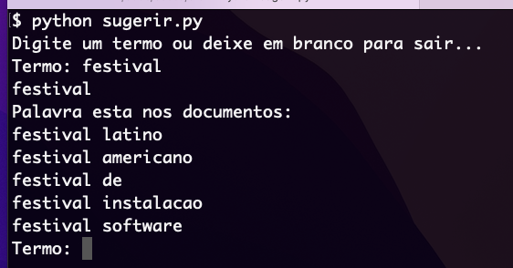

Architecture decision record (ADR)
===
> _Em tradução livre "Registro de decisões de Arquiteturais"_

Para primeira versão do sistema de sugestão, uma espécie de ```type ahead```...

Resultado das primeira versão.



> Alguns vídeos que falam sobre:
> - [**The Unreasonable Effectiveness Of Plain Text** no canal do YouTube NoBoilerPlat (em ingles)](https://www.youtube.com/watch?v=WgV6M1LyfNY)
> - [O que são ADRs (Architecture Decision Records)? por André Secco no YouTube](https://www.youtube.com/watch?v=5AjYSJrCnS0)
> - [Plugin JQuery TypeAhead](https://twitter.github.io/typeahead.js/examples/)